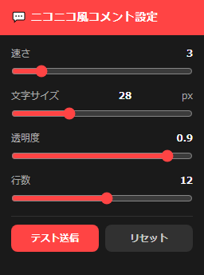

[English](README.md) | [日本語](README.ja.md)

# 📺 YouTube ニコニコ風コメント拡張
YouTubeのライブ配信のコメントを、ニコニコ動画のように画面上に流す拡張機能です。
お好みに合わせて細かくカスタマイズ可能です。

- **スピード調整:** コメントが流れる速さを変更できます。
- **文字カスタマイズ:** サイズや透明度を調整して、映像の邪魔にならないように設定できます。
- **表示領域の設定:** 同時に流れる行数を指定できます。
- **テスト送信機能:** 設定したデザインがどう見えるか、その場ですぐに確認できます。
- **リセット機能:** いつでも初期設定に戻せるので、気軽にカスタマイズを楽しめます。

## 🚀 導入方法（インストール手順）

ストアを通さない開発版のため、以下の手順でブラウザに読み込ませてください。

1. **ファイルをダウンロードする**
   - 右上の緑色の「Code」ボタンをクリックし、**「Download ZIP」**を選択してダウンロードします。
   - ダウンロードした ZIP ファイルを右クリックして「すべて展開（解凍）」します。

2. **ブラウザの拡張機能ページを開く**
   - Chrome または Edge を開き、アドレスバーに `chrome://extensions/` と入力してエンターキーを押します。

3. **デベロッパーモードを有効にする**
   - 画面上にある**「デベロッパーモード」**（または開発者モード）のスイッチを **ON** にします。

4. **フォルダを読み込む**
   - 画面上にある**「展開して読み込む（Load unpacked）」**ボタンをクリックします。
   - 先ほど解凍したフォルダ（`manifest.json` が入っている場所）を選択して「フォルダの選択」を押します。

5. **完了**
   - YouTubeのライブ配信などを開くと、コメントが画面上を流れ始めます。

## 📄 ライセンス (License)

このソフトウェアは、**MITライセンス**のもとで公開されています。

Copyright (c) 2026 [eses8sama]

以下に定める条件に従い、本ソフトウェアおよび関連文書のファイル（以下「ソフトウェア」）の複製を取得するすべての人に対し、ソフトウェアを無制限に扱う権利を無償で許諾します。これには、ソフトウェアの複製を使用、複写、変更、結合、掲載、頒布、サブライセンス、および/または販売する権利、およびソフトウェアを提供する相手に同じ権利を許可することを含みます。

上記の著作権表示および本許諾表示を、ソフトウェアのすべての複製または重要な部分に記載するものとします。

本ソフトウェアは「現状のまま」提供され、明示的か黙示的かを問わず、商品性、特定の目的への適合性、および権利非侵害の保証を含むがこれらに限定されない、いかなる種類の保証もありません。作者または著作権者は、契約の記述、不法行為、あるいはその他であろうとなかろうと、ソフトウェアに起因または関連して生じた、あるいはソフトウェアの使用またはその他の扱いによって生じた、いかなる請求、損害、またはその他の責任に対しても責任を負わないものとします。
